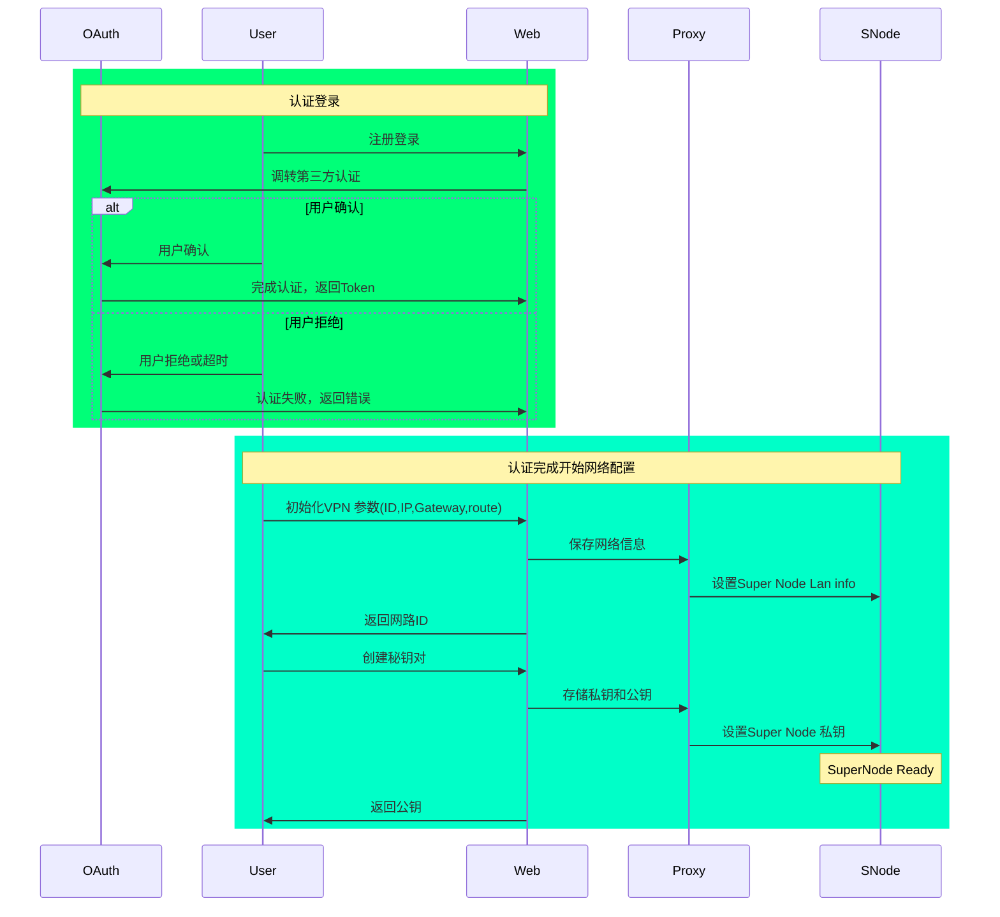

## 1: 用户初始化网络

```mermaid
sequenceDiagram
    participant OAuth
    participant User
    participant Web

    participant Proxy
    participant SNode


    rect rgb(0, 255, 120)
    %% auth2.0 block
        Note over OAuth,Web : 认证登录
        User ->> Web : 注册登录
        Web ->> OAuth : 调转第三方认证
        alt 用户确认
            User ->> OAuth : 用户确认
            OAuth ->> Web : 完成认证，返回Token
        else 用户拒绝
            User ->> OAuth : 用户拒绝或超时
            OAuth ->> Web : 认证失败，返回错误
        end
    end

    %% init network
    rect rgb(0, 255, 200)
        Note over User,SNode : 认证完成开始网络配置
        User ->> Web : 初始化VPN 参数(ID,IP,Gateway,route)
        Web ->> Proxy : 保存网络信息
        Proxy ->> SNode : 设置Super Node Lan info
        Web ->> User : 返回网路ID
        User ->> Web : 创建秘钥对
        Web ->> Proxy : 存储私钥和公钥
        Proxy ->> SNode : 设置Super Node 私钥
        Note over SNode : SuperNode Ready
        Web ->> User : 返回公钥

    end
```
